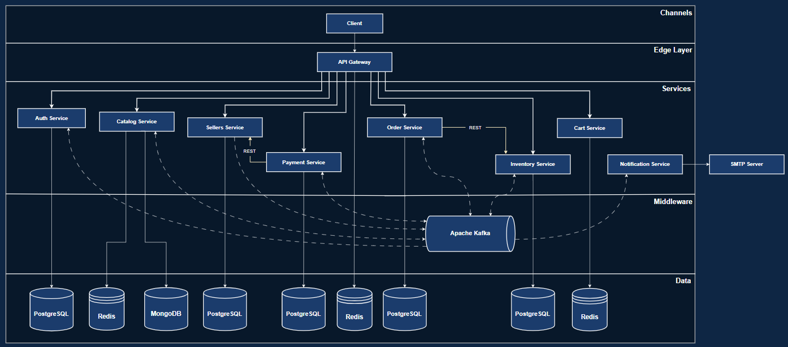
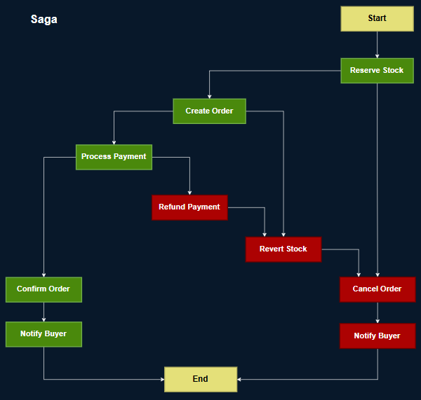
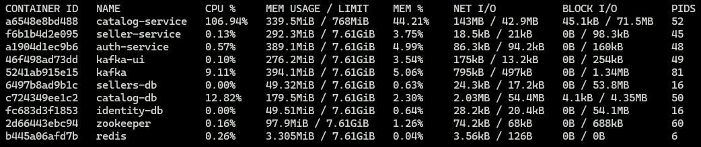

# eCommerce Backend — Production-Grade Microservices Platform

A fully distributed eCommerce backend built from scratch with production-grade practices. This isn't a tutorial project, every architectural decision is intentional, documented, and justified. The goal was to build a system that degrades gracefully under load, recovers from failures automatically, and scales horizontally when a single instance reaches its limit.

---

## Architecture Overview



The system is organized into four layers:

- **Edge Layer** — API Gateway handles routing, rate limiting, CORS, and security headers. For screens that require data from multiple services (such as a product detail page combining catalog, inventory, and seller info), the Gateway performs parallel request aggregation internally, keeping the frontend interface simple without adding an extra service to the infrastructure.

- **Services Layer** — Eight independent microservices, each owning its domain completely. No shared databases. No shared libraries.

- **Middleware Layer** — Apache Kafka decouples asynchronous communication.

- **Data Layer** — Each service owns its persistence technology. MongoDB for the product catalog (flexible document model), PostgreSQL for transactional services (ACID guarantees), Redis for session-like data (cart, rate limiting).

---

## Services

| Service | Responsibility | Stack |
|---|---|---|
| **Auth Service** | OAuth2 Authorization Server — issues JWTs, manages registered clients | Spring Authorization Server, PostgreSQL |
| **Catalog Service** | Product management, search, homepage feed | Spring WebFlux, MongoDB, Reactive Redis, Kafka |
| **Inventory Service** | Stock reservation, compensation, seller stock management | Spring MVC, PostgreSQL, Kafka |
| **Order Service** | Saga orchestrator — checkout, multi-seller order splitting | Spring MVC, PostgreSQL, Kafka, WebClient |
| **Payment Service** | Card tokenization, payment simulation, refunds | Spring MVC, PostgreSQL, Kafka, WebClient |
| **Cart Service** | Session cart per authenticated user | Spring WebFlux, Redis |
| **Seller Service** | Seller profiles, bank account management | Spring MVC, PostgreSQL, Kafka |
| **Notification Service** | Real email delivery on order events | Spring Boot, JavaMail (Gmail SMTP), Kafka |
| **API Gateway** | Routing, rate limiting, security headers, CORS | Spring Cloud Gateway, Redis |

---

## Architectural & Design Patterns

Every pattern in this project was chosen deliberately. Here's what was applied and why.

### Hexagonal Architecture (Ports & Adapters)
Applied to **Catalog Service**. The domain logic has zero knowledge of MongoDB, Redis, or Kafka. It only knows about interfaces (ports). MongoDB, Redis, and Kafka are adapters that implement those interfaces. Switching image storage from local filesystem to S3 requires adding one adapter class. Zero domain changes. This is the reason the service could be tested in isolation and load-tested without any external dependencies being a bottleneck.

### Saga Pattern (Choreography)
Applied to the **Order → Payment → Inventory → Notification** flow. A distributed transaction spans four services and cannot be wrapped in a single ACID transaction. The Saga ensures consistency through compensation: if payment fails, stock is automatically reversed and the buyer is notified. Every Saga step publishes an event that the next participant consumes. Every compensation action is the inverse of the forward step.

### Idempotent Consumers
Every service that has important tasks related to events checks a `processed_events` table before processing. If the `eventId` already exists, the message is silently skipped. This makes every consumer idempotent, reprocessing the same event any number of times produces the same result. This is critical for a system where Kafka may deliver messages more than once and the process within it are critical.

### Event Sourcing Metadata (Correlation & Causation)
Every event part of the Saga carries:
- `correlationId` — the `orderId`, shared across all events of the same Saga
- `causationId` — the `eventId` of the event that caused this one
- `checkoutId` — groups all orders from the same checkout session

This makes the entire distributed transaction traceable across services without a centralized tracing system.

### Read Model / Local Cache Pattern
**Order Service** maintains its own `product_catalog_snapshot` table, fed by Catalog events (`ProductCreated`, `ProductDeleted`, `ProductPriceChanged`). When a user checks out, prices are validated locally, no synchronous call to Catalog at the most critical moment in the system. This is eventual consistency as a deliberate trade-off: a slightly stale price snapshot is far less dangerous than a synchronous dependency that can fail mid-checkout.

### Strangler Fig (Bounded Contexts via DDD)
The user entity is intentionally split: **Auth Service** knows who you are (identity), **Seller Service** knows what kind of seller you are (business profile). These are different bounded contexts that happen to share a `userId` as a foreign key. Merging them would create the "God Service" anti-pattern.

### Circuit Breaker + Retry (Resilience4j)
Applied to the **Order → Inventory** synchronous call. The call is the only synchronous dependency in the entire checkout flow, it exists because stock reservation must be synchronous (you cannot tell 1,000 users their order was accepted and then fail 900 of them asynchronously). 

Is that how MercadoLibre or Amazon does it? No. At their scale, an async approach with eventual consistency makes sense, they have dedicated infrastructure to handle overselling, complex compensation flows, and the operational maturity to manage the trade-offs that come with it. At that scale, the cost of a synchronous dependency outweighs the cost of managing phantom orders.

But in my project is a service with no dedicated oversell management layer. Here, the synchronous call is the simpler and safer choice, and simpler is often the right engineering decision when you don't have the scale that justifies the complexity.

Resilience4j wraps this call with:
- **Retry**: 2 attempts with exponential backoff (300ms, 600ms)
- **Circuit Breaker**: opens after 50% failure rate over 10 calls, stays open for 30 seconds

Business exceptions (`InsufficientStockException`, `ProductNotFoundException`) are explicitly excluded from retry logic, retrying a business rule is pointless.

### OAuth2 Client Credentials (Service-to-Service Security)
Internal service calls are authenticated using OAuth2 Client Credentials flow. **Order Service** is a registered OAuth2 client with `scope: inventory:reserve`. **Payment Service** has `scope: seller:bankInfo`. Each service obtains a short-lived token (5 minutes) from the Auth Service and presents it on every internal request. **No hardcoded secrets. No shared API keys. No trust-by-network.**

Each microservice validates tokens independently, security is not centralized in the Gateway. This follows the Defense in Depth principle: if the Gateway is compromised or bypassed, every service still enforces its own authorization rules.

### Multi-Seller Order Splitting
A single checkout request containing products from multiple sellers is automatically split into independent orders, one per seller, each with its own lifecycle, payment, and Saga. This is how MercadoLibre work. If seller A's stock fails, seller B's order still proceeds. The `checkoutId` groups all resulting orders for the user's view.

### Card Tokenization
Card data never enters the backend system. The frontend tokenizes the card number with the Payment Service before the checkout flow begins. What flows through Order Service and the Saga is an opaque token string. No PCI scope. No card numbers in any database, log, or event.


### Tolerant Consumer
Every Kafka consumer in this system is deliberately tolerant of schema evolution. All consumers are configured with `FAIL_ON_UNKNOWN_PROPERTIES = false`, if a producer adds new fields to an event, consumers that don't need those fields simply ignore them and continue processing normally. No consumer breaks. No deployment coordination required.
This means a producer can evolve its event schema forward (adding optional fields) without any consumer needing to be updated or redeployed simultaneously. The only contract that matters is: don't remove fields that consumers depend on, and don't change their meaning. Everything else is free to change independently.

This is the pattern that makes truly independent deployments possible in an event-driven system. Without it, every schema change becomes a coordinated multi-service deployment, which defeats the purpose of having independent services in the first place

---

## The Order Saga



---

## Load Test Results — Catalog Service

The reactive stack was validated under real load. The test used a realistic traffic distribution:
- 70% homepage reads (Redis cache)
- 20% product creation (multipart upload → Kafka)
- 10% search with filters (MongoDB)

### Normal load — 200 VUs, 5 minutes

| Metric | Value |
|---|---|
| Total requests | 38,800 |
| Throughput | 129.3 req/s |
| Error rate | 0.000% |
| Homepage p(95) | **8ms** — Redis cache working under real concurrency |
| Search p(95) | 8ms |
| Create p(95) | 14ms |
| Products created | 7,647 — zero write failures |

### Breaking point — 800 VUs, 10 minutes

| Metric | Value |
|---|---|
| Total requests | 303,420 |
| Throughput | 505 req/s |
| Error rate | 0.000% |
| p(95) latency | 1,354ms |
| Products created | 60,782 — zero write failures |

**What the breaking point revealed:** At 800 VUs, the catalog-service CPU hit 106% of its single allocated core. Redis was at 0.26%. MongoDB at 12.82%. Kafka stable. The bottleneck was exclusively the CPU, the Netty event loop was saturated processing concurrent multipart uploads, which delayed even cached responses.

The service never crashed. It degraded gracefully and accepted every request.




**The conclusion:** The fix is not a code change. A second instance behind a load balancer would nearly double throughput because every other component has headroom. That's the point of building with a reactive stack and hexagonal architecture, when you hit the wall, the answer is infrastructure, not refactoring.

---

## Running Locally

### Prerequisites
- Docker Desktop
- Java 17
- Maven

### 1. Clone the repository
```bash
git clone https://github.com/CRT-Dev21/ecommerce-backend-microservices-platform
cd ecommerce-backend-microservices-platform
```

### 2. Configure environment variables
Create a `.env` file at the root:
```env
GMAIL_USERNAME=your-email@gmail.com
GMAIL_APP_PASSWORD=your-16-char-app-password
```

Gmail App Password: Google Account → Security → 2-Step Verification → App Passwords.

### 3. Start all services
```bash
docker-compose up --build
```

### 4. Service ports

| Service | Port |
|---|---|
| API Gateway | 8080 |
| Auth Service | 8083 |
| Catalog Service | 8081 |
| Inventory Service | 8087 |
| Order Service | 8084 |
| Payment Service | 8089 |
| Cart Service | 8086 |
| Seller Service | 8082 |
| Notification Service | 8091 |
| Kafka UI | 8090 |

### 5. Authenticate

Import the Postman collection from `docs/postman_collection.json` for the complete request flow including OAuth2 authorization.

---

## Full Checkout Flow

```
1. POST /api/payments/tokenize          → get paymentMethodToken
2. POST /api/sellers                    → register as seller (if needed)
3. POST /api/products                   → create products with images
4. POST /api/cart/items                 → add items to cart
5. POST /api/orders/checkout            → checkout (splits by seller, starts Sagas)
6. Check email                          → confirmation or failure notification
7. POST /api/orders/{orderId}/refund    → request refund (triggers compensation Saga)
```

---

## Tech Stack Summary

**Languages & Runtimes:** Java 17

**Frameworks:** Spring Boot 3.5, Spring WebFlux, Spring Security, Spring Data JPA, Spring Data MongoDB Reactive, Spring Data Redis Reactive, Spring Cloud Gateway, Spring Authorization Server

**Messaging:** Apache Kafka

**Databases:** PostgreSQL, MongoDB, Redis

**Resilience:** Resilience4j (Circuit Breaker, Retry)

**Security:** OAuth2 Authorization Code Flow (user authentication), OAuth2 Client Credentials Flow (service-to-service), JWT (RS256)

**Load Testing:** k6

**Containerization:** Docker, Docker Compose

**Observability:** Kafka UI, structured logging with correlation IDs

---

## Author

**Cesar Romero** — Software Engineer · Oracle Certified Professional Java SE 17

[LinkedIn](https://linkedin.com/in/cesar-romero-java) · [GitHub](https://github.com/CRT-Dev21)