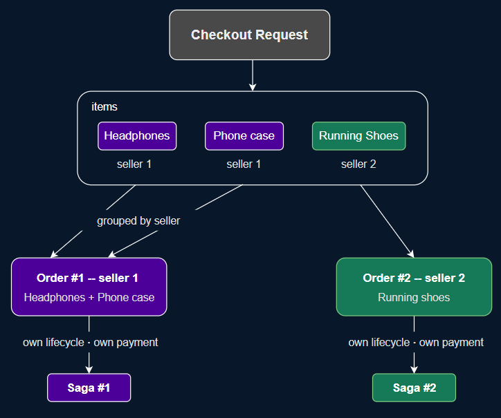
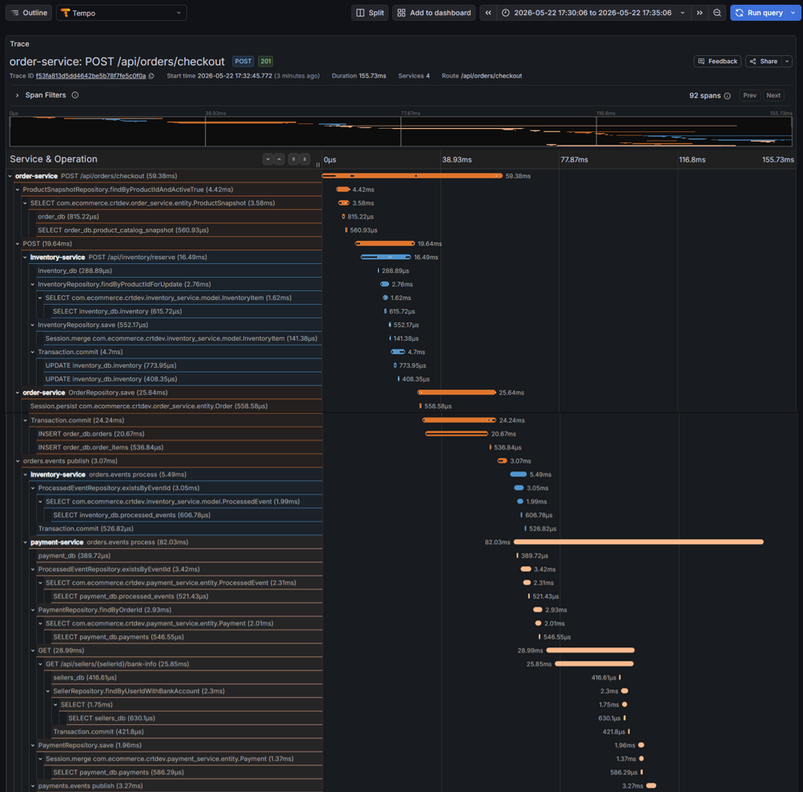
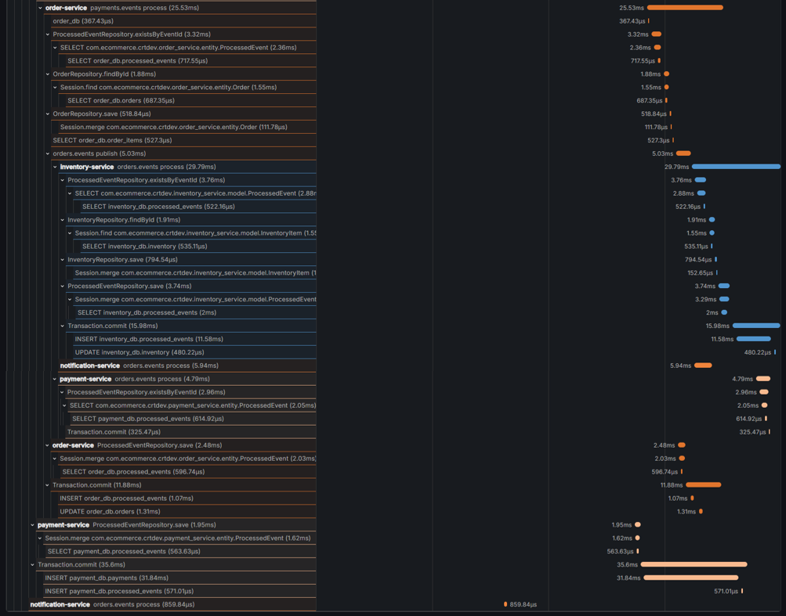
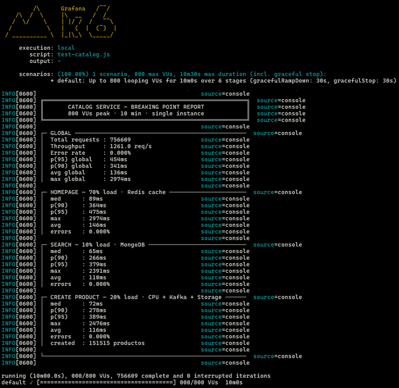

# AI-Powered eCommerce Backend — Production-Grade Microservices Platform

A fully distributed eCommerce backend built from scratch with production-grade practices. This isn't a tutorial project, every architectural decision is intentional, documented, and justified. The system handles the full commerce lifecycle from product catalog to checkout, payment, and notifications, and includes an AI-powered search service that understands natural-language queries and responds based exclusively on real catalog data.

---

## Architecture Overview


The system is organized into five layers:

- **Edge Layer** — API Gateway handles routing, rate limiting, CORS, and security headers. For screens that require data from multiple services (such as a product detail page combining catalog, inventory, and seller info), the Gateway performs parallel request aggregation internally, keeping the frontend interface simple without adding an extra service to the infrastructure.

- **Services Layer** — Nine independent microservices, each owning its domain completely. No shared databases. No shared libraries.

- **AI Layer** — Ollama runs the embedding model (`nomic-embed-text`) and the generative model (`llama3.2`).

- **Middleware Layer** — Apache Kafka decouples asynchronous communication.

- **Data Layer** — Each service owns its persistence technology. MongoDB for the product catalog (flexible document model), PostgreSQL for transactional services (ACID guarantees), Redis for session-like data (cart, rate limiting), Qdrant as the vector store for semantic search.

---

## Services

| Service | Responsibility | Stack |
|---|---|---|
| **Auth Service** | OAuth2 Authorization Server - issues JWTs, manages registered clients | Spring Authorization Server, PostgreSQL |
| **Catalog Service** | Product management - search, homepage feed | Spring Boot 4, Java 21, Redis, MongoDB, Kafka |
| **Inventory Service** | Stock reservation - compensation, seller stock management | Spring MVC, PostgreSQL, Kafka |
| **Order Service** | Saga coordinator - checkout, multi-seller order splitting | Spring MVC, PostgreSQL, Kafka, WebClient |
| **Payment Service** | Card tokenization - payment simulation, refunds | Spring MVC, PostgreSQL, Kafka, WebClient |
| **Cart Service** | Session cart per authenticated user | Spring WebFlux, Redis |
| **Seller Service** | Seller profiles, bank account management | Spring MVC, PostgreSQL, Kafka |
| **Notification Service** | Real email delivery on order events | Spring Boot, JavaMail (Gmail SMTP), Kafka |
| **RAG Service** | Natural-language product search powered by vector embeddings and a local LLM | Spring Boot 4, Java 21, Spring AI, Kafka, Qdrant, Ollama |
| **API Gateway** | Routing, rate limiting, security headers, CORS | Spring Cloud Gateway, Redis |

---

## RAG Service - AI-Powered Product Search

The RAG Service adds natural-language search to the platform. A user can ask *"I need something portable for listening to music at the gym"* and receive a grounded answer based exclusively on real products in the catalog. No hallucinated products, no invented prices.

### How it works

The pipeline has two independent flows:

**Indexing flow (event-driven)**
The RAG Service consumes `catalog.events` from Kafka. Every time a product is created, updated, or deleted in the Catalog Service, an event is published automatically. The RAG Service reacts to those events by generating a vector embedding of the product's text (name, description, category) via Ollama and upserting it into Qdrant. Deletions remove the vector from the store. There is no cron job, no polling, no manual re-indexing trigger under normal operation.

**Query flow (on demand)**
When a user submits a natural-language query, the RAG Service embeds the query using the same model, performs a vector similarity search in Qdrant to retrieve the top-K most semantically relevant products, constructs a prompt with those products as context, and sends it to the LLM. The LLM generates a response grounded exclusively in the retrieved products.

The response includes both the generated answer and the source products used as context, making the retrieval fully auditable.

### Why retrieval quality matters more than the LLM

The LLM can only reason about what the retrieval step gives it. If Qdrant returns irrelevant products, the LLM cannot compensate, it simply never sees the correct ones. The system prompt explicitly instructs the model not to invent products or prices and to state clearly when no relevant product exists in the catalog. This is what prevents hallucination in a RAG system, constraining the generation to the retrieved context, not relying on the model's parametric knowledge.

### Hexagonal Architecture applied to RAG

| Port | Local adapter |
|---|---|
| `EmbeddingPort` | `OllamaEmbeddingAdapter` |
| `TextGenerationPort` | `OllamaGenerationAdapter` |
| `VectorStorePort` | `QdrantVectorStoreAdapter` |

Switching from the local stack to AWS Bedrock + OpenSearch Serverless requires adding new adapter classes. Zero use case changes.

---

## Kubernetes Deployment

The entire platform is deployable to Kubernetes. Every service has a complete set of manifests covering deployment, networking, configuration, storage, and autoscaling.

### Manifest structure

```
k8s/
├── ingress.yaml
├── api-gateway/
│   ├── gateway-deployment.yaml
│   └── gateway-configmap.yaml
├── auth-service/
│   ├── auth-deployment.yaml
│   ├── auth-configmap.yaml
│   ├── auth-hpa.yaml
│   └── auth-rsa-secret.yaml
├── catalog-service/
│   ├── catalog-deployment.yaml
│   ├── catalog-configmap.yaml
│   ├── catalog-pvc.yaml
│   └── catalog-hpa.yaml
└── ... (one folder per service)
```

### What each manifest covers

**Deployment**: Defines the container image, environment variables sourced from ConfigMaps and Secrets, resource limits (CPU and memory), and health checks via Spring Boot Actuator:

```yaml
livenessProbe:
  httpGet:
    path: /actuator/health/liveness
    port: 8080
  timeoutSeconds: 5
  periodSeconds: 15
  failureThreshold: 5
readinessProbe:
  httpGet:
    path: /actuator/health/readiness
    port: 8080
  timeoutSeconds: 5
  failureThreshold: 3
```

The distinction between liveness and readiness is intentional. Liveness tells Kubernetes when to restart a pod. Readiness tells Kubernetes when the pod is ready to receive traffic. Without this separation, the Gateway would route requests to pods still initializing.

**Service**: Provides a stable DNS name and IP for each Deployment. Pods are ephemeral and their IPs change on every restart. The Service is what makes `http://catalog-service:8082` a reliable address regardless of which pod instance is currently running.

**ConfigMap and Secret**: All environment-specific configuration is externalized. Non-sensitive values (hostnames, ports, feature flags) live in ConfigMaps. Sensitive values (database passwords, JWT secrets) live in Secrets. No configuration is hardcoded in the image.

**PersistentVolumeClaim**: Applied to the Catalog Service for product image storage. Pods are stateless by design so a PVC ensures uploaded images survive pod restarts and rescheduling.

**HorizontalPodAutoscaler**: Applied to the Catalog Service, which handles the highest read traffic in the system:

```yaml
minReplicas: 3
maxReplicas: 5
metrics:
  - type: Resource
    resource:
      name: cpu
      target:
        type: Utilization
        averageUtilization: 70
```

At 70% CPU utilization across the existing pods, Kubernetes automatically schedules additional replicas up to the defined maximum. The load test results (1,261 req/s on a single instance) establish the baseline, with HPA the service scales horizontally before latency degrades.

**Ingress**: Exposes the API Gateway to external traffic with path-based routing. All external requests enter through a single entry point so internal service-to-service communication stays within the cluster network.

### Running on Kubernetes (minikube)

```bash
# Start minikube with enough resources
minikube start --cpus=4 --memory=8192

# Enable ingress controller
minikube addons enable ingress

# Create the ecommerce namespace
kubectl create namespace ecommerce

# Apply infrastructure (Kafka, databases)
kubectl apply -f k8s/kafka/
kubectl apply -f k8s/SERVICE/SERVICE-db.yaml

# Apply services
kubectl apply -f k8s/auth-service/auth-deployment.yaml
kubectl apply -f k8s/catalog-service/catalog-deployment.yaml
# ... remaining services

# Verify all pods are running
kubectl get pods -n ecommerce
```

---

## Observability - Grafana Stack on Kubernetes

The platform runs a full observability stack composed of Prometheus, Loki, Tempo, and Grafana, deployed in a dedicated `observability` namespace via Helm. All telemetry is collected from the `ecommerce` namespace without any changes to service source code.

```
k8s/
└── observability/
    ├── override-values.yaml   # Helm values unifying all four components
```

### Three pillars

**Prometheus**
Every microservice exposes JVM, server, and business metrics via Spring Boot Actuator at `/actuator/prometheus`. Prometheus is configured with global dynamic discovery across the cluster: Deployments annotated with `prometheus.io/scrape: "true"` are automatically detected and scraped.

**Tempo**
Traces are collected using automatic instrumentation via the OpenTelemetry Java Agent, injected into each container through an `initContainer` that downloads the agent at pod startup. The agent intercepts all inbound and outbound requests and exports spans to Tempo over OTLP/gRPC on port 4317. Zero changes to any service's source code or dependencies.

**Loki + Promtail**
All microservices write to stdout, following the Kubernetes logging convention. Promtail runs as a DaemonSet on each cluster node, reads log files directly from `/var/log/pods`, enriches them with cluster metadata (namespace, pod name, container name), and ships them to Loki.

### Grafana

Grafana connects all three data sources through a single `override-values.yaml` injected via Helm. The key integration is the correlation between Loki and Tempo via `matcherRegex`, when viewing a log entry in Loki that contains an OpenTelemetry `trace_id`, Grafana renders a direct button to jump to the full distributed trace in Tempo.

---

## Architectural & Design Patterns

Every pattern in this project was chosen deliberately. Here's what was applied and why.

### Hexagonal Architecture (Ports & Adapters)
Applied to **Catalog Service** and **RAG Service**. The domain logic has zero knowledge of MongoDB, Redis, Kafka, Ollama, or Qdrant. It only knows about interfaces (ports). MongoDB, Redis, Kafka, Ollama, and Qdrant are adapters that implement those interfaces. Switching them for some Amazon Service like Amazon Bedrock or S3 requires adding one adapter class. Zero domain changes.

### Saga Pattern (Choreography)
The checkout flow spans four independent services **Order -> Inventory -> Payment -> Notification**, and cannot be wrapped in a single ACID transaction. The Choreography Saga pattern manage the distributed transaction with a chain of events, each service reacts to what happened, does its work, and publishes the result.

### Idempotent Consumers
Every service that has important tasks related to events checks a `processed_events` table before processing. If the `eventId` already exists, the message is silently skipped. This makes every consumer idempotent so reprocessing the same event any number of times produces the same result. This is critical for a system where Kafka may deliver messages more than once and the processes within it are critical.

### Read Model / Local Cache Pattern
**Order Service** maintains its own `product_catalog_snapshot` table, fed by Catalog events (`ProductCreated`, `ProductDeleted`, `ProductPriceChanged`). When a user checks out, prices are validated locally, no synchronous call to Catalog at the most critical moment in the system. This is eventual consistency as a deliberate trade-off, a slightly stale price snapshot is far less dangerous than a synchronous dependency that can fail mid-checkout.

### Bounded Contexts via DDD
Domain-Driven Design guided the service boundaries in this system. The key insight is that the same real-world concept can belong to different bounded contexts, and forcing them into a single service creates the God Service anti-pattern.

**User identity vs. seller profile**: Auth Service knows who you are (authentication, roles, tokens). Seller Service knows what kind of business you run (profile, bank account, product catalog ownership). These share a userId as a foreign key but have completely different lifecycles, schemas, and responsibilities. Merging them would mean Auth Service needs to know about bank accounts, and Seller Service needs to know about JWTs.

**Product information vs. product stock**: Catalog Service owns the product as a browsing entity: name, description, price, images, category. Inventory Service owns the same product as an operational entity: available stock, reserved stock, version for optimistic locking. The name of a product changes rarely. The stock changes on every order, reservation, and cancellation. Coupling them would mean every stock write contends with catalog reads on the same entity.

This separation also unlocked independent technical decisions: Catalog uses MongoDB because products are documents with variable structure. Inventory uses PostgreSQL because stock operations demand ACID guarantees. The same service cannot optimize for both.

### Circuit Breaker + Retry (Resilience4j)
Applied to the **Order -> Inventory** synchronous call. The call is the only synchronous dependency in the entire checkout flow. It exists because I didn't want to notify 1,000 users that their order was accepted and then have 900 of them fail asynchronously.

Is that how MercadoLibre or Amazon does it? No. At their scale, an async approach with eventual consistency makes sense, they have dedicated infrastructure to handle overselling, complex compensation flows, and the operational maturity to manage the trade-offs that come with it. At that scale, the cost of a synchronous dependency outweighs the cost of managing phantom orders.

But in this project the synchronous call is the simpler and safer choice, and simpler is often the right engineering decision when you don't have the scale that justifies the complexity.

Resilience4j wraps this call with:
- **Retry**: 2 attempts with exponential backoff (300ms, 600ms)
- **Circuit Breaker**: opens after 50% failure rate over 10 calls, stays open for 30 seconds

Business exceptions (`InsufficientStockException`, `ProductNotFoundException`) are explicitly excluded from retry logic because retrying a business rule is pointless.

### OAuth2 Client Credentials (Service-to-Service Security)
Internal service calls are authenticated using OAuth2 Client Credentials flow. **Order Service** is a registered OAuth2 client with `scope: inventory:reserve`. **Payment Service** has `scope: seller:bankInfo`. Each service obtains a short-lived token (5 minutes) from the Auth Service and presents it on every internal request.

Each microservice validates tokens independently, security is not centralized in the Gateway. This follows the Defense in Depth principle: if the Gateway is compromised or bypassed, every service still enforces its own authorization rules.

### Card Tokenization
Card data never enters the backend system. The frontend tokenizes the card number with the Payment Service before the checkout flow begins. What flows through Order Service and the Saga is an opaque token string. No PCI scope. No card numbers in any database, log, or event.

### Tolerant Consumer
Every Kafka consumer in this system is deliberately tolerant of schema evolution. All consumers are configured with `FAIL_ON_UNKNOWN_PROPERTIES = false`, if a producer adds new fields to an event, consumers that don't need those fields simply ignore them and continue processing normally. No consumer breaks. No deployment coordination required.

This means a producer can evolve its event schema forward (adding optional fields) without any consumer needing to be updated or redeployed simultaneously. The only contract that matters is: don't remove fields that consumers depend on, and don't change their meaning. Everything else is free to change independently.

This is the pattern that makes truly independent deployments possible in an event-driven system. Without it, every schema change becomes a coordinated multi-service deployment, which defeats the purpose of having independent services in the first place.

### Multi-Seller Order Splitting
A single checkout request containing products from multiple sellers is automatically split into independent orders, one per seller. Each order has its own lifecycle, payment, and Saga. This is how MercadoLibre works. If seller A's stock fails, seller B's order still proceeds. The `checkoutId` groups all resulting orders for the user's view.



---

## The Order Saga


---

## Saga End-to-End Validation — Distributed Tracing with Tempo

The complete Saga flow was instrumented and validated end-to-end using Tempo and Grafana. Every service emits spans automatically via the OpenTelemetry Java Agent.

### The critical path

```
POST /api/orders/checkout
  └── Order Service
        ├── [sync]  Inventory Service — stock reservation
        │             └── responds: reserved or insufficient
        └── [kafka] publishes to orders.events
              └── Payment Service — processes payment
                    └── [kafka] publishes to payments.events
                          └── Order Service — receives payment result
                                ├── updates order status
                                └── [kafka] publishes order confirmed or cancelled
                                      ├── Inventory Service
                                      │     └── commits reservation or releases stock
                                      └── Notification Service
                                            └── sends email to user
```

### Result

**Total end-to-end duration: 155.73ms** across four services, Kafka, one synchronous call, and one SMTP email delivery, all measured as a single distributed trace in Tempo.




### Production issue found and resolved via tracing

Tempo revealed that the Notification Service was consistently adding ~2 seconds to the total Saga duration. The root cause was that the `@KafkaListener` consumer thread was blocking on the SMTP call to Gmail's server, holding the thread for the entire duration of the external email delivery. This matters beyond just latency: under high concurrency, if the consumer thread is occupied processing slow or synchronous I/O one message at a time and fails to poll the broker before the session timeout expires, the Kafka broker assumes the consumer has died and triggers a partition rebalance disrupting the entire consumer group.

The fix was applying `@Async` to the mail delivery method, offloading the SMTP call to a dedicated thread pool and releasing the Kafka consumer thread immediately after message acknowledgment.

```
Before @Async:  Saga total ≈ 2,000ms  (consumer thread blocked on SMTP)
After  @Async:  Saga total =   155ms  (consumer thread released immediately)
```
---

## Load Test Results - Catalog Service

The Catalog Service was benchmarked twice under identical conditions to evaluate the impact of switching from a reactive stack (WebFlux + Reactor) to an imperative stack with virtual threads (Spring Boot 4 + Java 21). Same hexagonal architecture, same endpoints, same traffic distribution:

- 70% homepage reads (Redis cache)
- 20% product creation (multipart upload → MongoDB → Kafka)
- 10% search with filters (MongoDB)

### Normal load - 200 VUs, 5 minutes (reactive baseline)

| Metric | Value |
|---|---|
| Total requests | 38,800 |
| Throughput | 129.3 req/s |
| Error rate | 0.000% |
| Homepage p(95) | 8ms |
| Search p(95) | 8ms |
| Create p(95) | 14ms |
| Products created | 7,647 — zero write failures |

### Breaking point - 800 VUs, 10 minutes
Two identical services, two different threading models:

| Metric | Reactive (WebFlux) | Imperative (Virtual Threads) | Delta |
|---|---|---|---|
| Total requests | 303,420 | 756,609 | **+149%** |
| Throughput | 505 req/s | 1,261 req/s | **+2.5x** |
| Avg latency | 581ms | 136ms | **-76%** |
| p(95) latency | 1,345ms | 454ms | **-66%** |
| Max latency | 2,363ms | 2,974ms | higher spikes |
| Error rate | 0.000% | 0.000% | equal |
| Products created | 60,782 | 151,515 | **+149%** |

**What the breaking point revealed:** At 800 VUs, the catalog-service CPU hit 106% of its single allocated core. Redis was at 0.26%. MongoDB at 12.82%. Kafka stable. The bottleneck was exclusively the CPU, the Netty event loop was saturated processing concurrent multipart uploads, which delayed even cached responses.

The service never crashed. It degraded gracefully and accepted every request.

**Why virtual threads won:** The reactive version wasn't slow because WebFlux is bad. It was slow because the overhead of the reactive model stopped paying for itself. Every request passed through Reactor's operator chain (flatMap, context propagation, scheduler switching) machinery that exists to maximize throughput when I/O latency is high and unpredictable. When your dependencies respond in single-digit milliseconds, you pay the cost of a non-blocking pipeline without getting the benefit.

Virtual threads flip the economics. When a virtual thread blocks waiting for Redis, MongoDB, or a Kafka ack, the underlying OS thread is immediately freed and picks up another request. No operator chains. No scheduler overhead. No backpressure management. The JVM handles the concurrency, and the code stays readable.

**When does WebFlux still make sense?** Streaming, SSE, or workloads with genuinely unpredictable external latency like third-party payment gateways, slow upstream APIs, real-time event pipelines where backpressure is a real concern.

### Reactive Catalog Service test results


### Catalog Service + Virtual Threads test results



---

## Running Locally

### Prerequisites
- Docker Desktop
- Java 21
- Maven

> **Note on first run:** The RAG Service depends on Ollama pulling two models (`nomic-embed-text` ~800MB, `llama3.2` ~2GB) before it starts. On first `docker-compose up` this can take several minutes depending on your connection. Subsequent starts use the cached models from the Docker volume.

### 1. Clone the repository
```bash
git clone https://github.com/CRT-Dev21/ecommerce-backend-microservices-platform
cd ecommerce-backend-microservices-platform
```

### 2. Configure environment variables
Create a `.env` file at the root:
```env
GMAIL_USERNAME=your-email@gmail.com
GMAIL_APP_PASSWORD=your-16-char-app-password
```

Gmail App Password: Google Account -> Security -> 2-Step Verification -> App Passwords.

### 3. Start all services
```bash
docker-compose up --build
```

### 4. Service ports

| Service | Port |
|---|---|
| API Gateway | 8080 |
| Auth Service | 8081 |
| Catalog Service | 8082 |
| Seller Service | 8083 |
| Payment Service | 8084 |
| Order Service | 8085 |
| Inventory Service | 8086 |
| Cart Service | 8087 |
| Notification Service | 8088 |
| RAG Service | 8089 |
| Kafka UI | 8090 |

### 5. Authenticate

Import the Postman collection from `docs/postman_collection.json` for the complete request flow including OAuth2 authorization.

### 6. Test the RAG Service

Create products through the Catalog Service first, then query:

```bash
curl -X POST http://localhost:8089/ai/search \
  -H "Content-Type: application/json" \
  -d '{"query": "I need a powerful computer for gaming"}'
```

---

## Full Checkout Flow

```
1. POST /api/payments/tokenize          -> get paymentMethodToken
2. POST /api/sellers                    -> register as seller (if needed)
3. POST /api/catalog/products                   -> create products with images
4. POST /api/cart/items                 -> add items to cart
5. POST /api/orders/checkout            -> checkout (splits by seller, starts Sagas)
6. Check email                          -> confirmation or failure notification
7. POST /api/orders/{orderId}/refund    -> request refund (triggers compensation Saga)
```

---

## Tech Stack Summary

**Languages & Runtimes:** Java 21

**Frameworks:** Spring Boot 4 (Catalog, RAG), Spring Boot 3.5 (remaining services), Spring MVC, Spring WebFlux, Spring AI, Spring Security, Spring Data JPA, Spring Data MongoDB Reactive, Spring Data Redis Reactive, Spring Cloud Gateway, Spring Authorization Server

**AI & ML:** Spring AI, Ollama (`nomic-embed-text` for embeddings, `llama3.2` for generation)

**Messaging:** Apache Kafka

**Databases:** PostgreSQL, MongoDB, Redis, Qdrant (vector store)

**Resilience:** Resilience4j (Circuit Breaker, Retry)

**Security:** OAuth2 Authorization Code Flow (user authentication), OAuth2 Client Credentials Flow (service-to-service), JWT

**Load Testing:** k6

**Containerization:** Docker, Docker Compose, Kubernetes (minikube)

**Observability:** Prometheus, Grafana, Loki, Tempo, OpenTelemetry, Micrometer, Promtail

---

## Author

**Cesar Romero** — Software Engineer · Oracle Certified Professional Java SE 17

[LinkedIn](https://linkedin.com/in/cesar-romero-java) · [GitHub](https://github.com/CRT-Dev21)